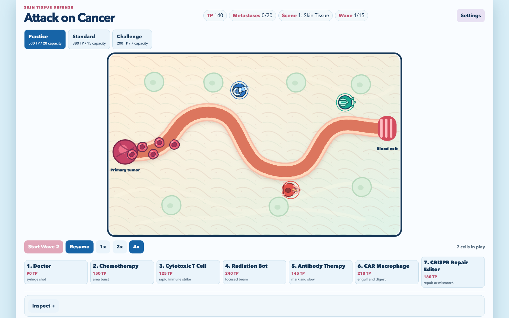
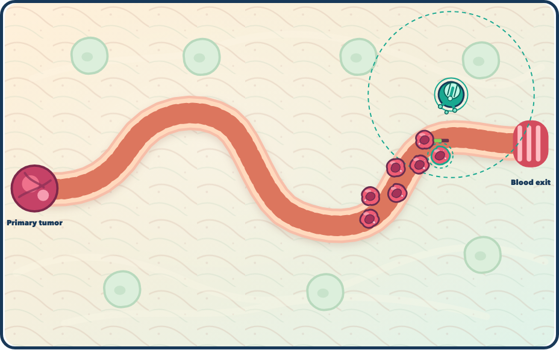

# Attack on Cancer

A bright browser tower-defense game for students and curious players who want to protect a Skin
Tissue route with readable cancer treatments rather than memorize biology facts.

**Status:** playable v1 vertical slice. It builds as a static GitHub Pages site with no account,
backend, analytics, or external art assets.

**Play online:** [vosslab.github.io/attack-on-cancer](https://vosslab.github.io/attack-on-cancer/)

## Two scenes, seven treatments

The signature promise is a complete tower-defense loop with biology as optional flavor: cartoon
cells leave a primary tumor, travel toward a blood vessel, and make every targeting decision visible.

- Clear 15 Skin Tissue waves, then rebuild for six much denser waves on the winding Cluster Corridor.
- Read each treatment at a glance: syringe shot, area burst, immune strike, radiation beam,
  antibody chain, phagocytic cup, or guide-RNA editor.
- Use pointer, touch, or keyboard controls; pause or fast-forward at 1x, 2x, or 4x.
- Choose Practice, Standard, or the intentionally dense, resource-tight Challenge mode.

## Hold the Skin Tissue line

The sequence moves from a paused Wave 1 overview to an Antibody Therapy targeting close-up, then
into the winding Cluster Corridor with a multi-tumor source and a dense wave. Together the views
show the readable route, treatment range, metastasis pressure, and scale change between scenes.

<!-- screenshots:begin (managed by screenshot-docs) -->



<!-- screenshots:end -->

## Quick start

Install Node.js dependencies once after cloning:

```bash
npm install
```

Build and serve the GitHub Pages artifact locally:

```bash
./run_web_server.sh
```

Build the static artifact without starting a server:

```bash
./build_github_pages.sh
```

Regenerate the ignored visual components and run the complete fast gate:

```bash
./run_fast_checks.sh
```

This consumer-owned wrapper builds generated artwork before invoking the reset-safe vendored
`check_codebase.sh`; use it instead of the vendored sub-gate on a clean checkout. The separate
browser contact sheet is produced by `./capture_screenshots.sh` under `test-results/visual-assets/`.

The build writes the GitHub Pages-ready site to `dist/`. The preview script selects a random local
port and opens the browser when run from an interactive macOS terminal. For a meaningful first
result, place a Doctor or T Cell on open tissue and select **Start Wave 1**.

## How to play

Choose a difficulty, place treatments on open tissue, and start waves when ready. Destroyed or
repaired cells earn Treatment Points (TP); every cell reaching the blood-vessel exit adds one
metastasis point.

- Clear the first 15 waves to unlock the Cluster Corridor. Its multi-tumor source feeds a longer,
  winding route and grants 200 TP for a fresh build.
- Clear all 21 waves and remaining cells to contain the cancer.
- Reaching the selected metastasis capacity ends the run.
- Select a placed treatment to upgrade its three linear tiers or sell it.
- Open the optional inspect panel for concise biology flavor about a selected treatment or cell.
- Face the Wave 15 Tumor Mass: a beating capstone that sheds cells while moving and ruptures when destroyed.

> Example: Antibody Therapy marks a blue Immune-Evasive cell. Its teal ring means the cell slows,
> takes more damage, and no longer resists a Cytotoxic T Cell attack.

## Controls

| Action                | Pointer or touch     | Keyboard                  |
| --------------------- | -------------------- | ------------------------- |
| Select treatment      | Select a tray button | `1` through `7`           |
| Move placement cursor | Move pointer         | Arrow keys                |
| Place treatment       | Tap or click tissue  | Enter                     |
| Cancel placement      | Select another tool  | Esc                       |
| Pause or resume       | Select Pause         | Space                     |
| Start the next wave   | Select Start Wave    | N                         |
| Change speed          | Select 1x, 2x, or 4x | Use the on-screen control |

## Treatment roster

| Treatment        | Role                                                                        | Attack cue                         |
| ---------------- | --------------------------------------------------------------------------- | ---------------------------------- |
| Doctor           | Low-cost syringe treatment for nearby single targets.                       | Dashed syringe shot.               |
| Chemotherapy     | Splash treatment for tight groups.                                          | Purple area burst.                 |
| Cytotoxic T Cell | Fast single-target immune attacks.                                          | Red rapid immune strike.           |
| Radiation Bot    | Expensive, long-range, heavy strikes.                                       | Heavy gold beam and target lock.   |
| Antibody Therapy | Marks, slows, and sensitizes cells; it removes immune evasion while marked. | Teal antibody chain and mark ring. |
| CAR Macrophage   | Experimental, slow, close-range engulfing with an antibody-marked bonus.    | Closing teal phagocytic cup.       |
| CRISPR Repair Editor | Speculative low-chance repair that gains confidence after mismatches. | Indigo guide-RNA target.           |

The CRISPR Repair Editor is a game abstraction, not an approved treatment. Its hopeful visual idea
is inspired by laboratory studies of [mutation correction in colorectal cancer cells](https://pubmed.ncbi.nlm.nih.gov/32021251/)
and [selective disruption of mutant EGFR](https://pubmed.ncbi.nlm.nih.gov/28575452/), not a claim
that editing a cancer cell would safely restore normal tissue in a patient.

## Difficulty

| Difficulty | Starting TP | Metastasis capacity |
| ---------- | ----------: | ------------------: |
| Practice   |         500 |                  20 |
| Standard   |         380 |                  15 |
| Challenge  |         200 |                   7 |

Each refresh starts a new run. Sound preference, preferred speed, and the best result per difficulty
are the only saved settings.

Challenge also sends 40% more cancer cells in every wave group. Practice and Standard use the
published fixed wave counts. All cell rewards and tower sale refunds are intentionally lean, so
each new placement remains a decision instead of an automatic purchase.

## More information

- [docs/GAME_DESIGN.md](docs/GAME_DESIGN.md) describes the v1 roster, rules, and scope boundary.
- [docs/SOLID_MODEL.md](docs/SOLID_MODEL.md) documents the client-side SolidJS model.
- [docs/CHANGELOG.md](docs/CHANGELOG.md) records implementation history.
- [docs/PLAYWRIGHT_USAGE.md](docs/PLAYWRIGHT_USAGE.md) explains browser-test setup and execution.

## Scope and license

This v1 ships two connected scenes, not a partial campaign. It intentionally excludes clinical
decision-making, patient outcomes, accounts, backend services, and additional maps beyond the
Cluster Corridor.

The project is available under the [MIT License](LICENSE.MIT.md).
