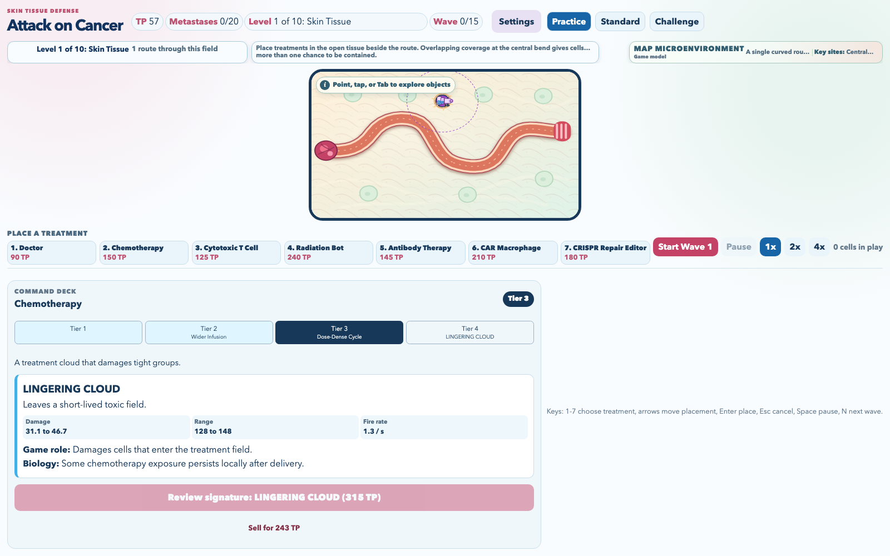
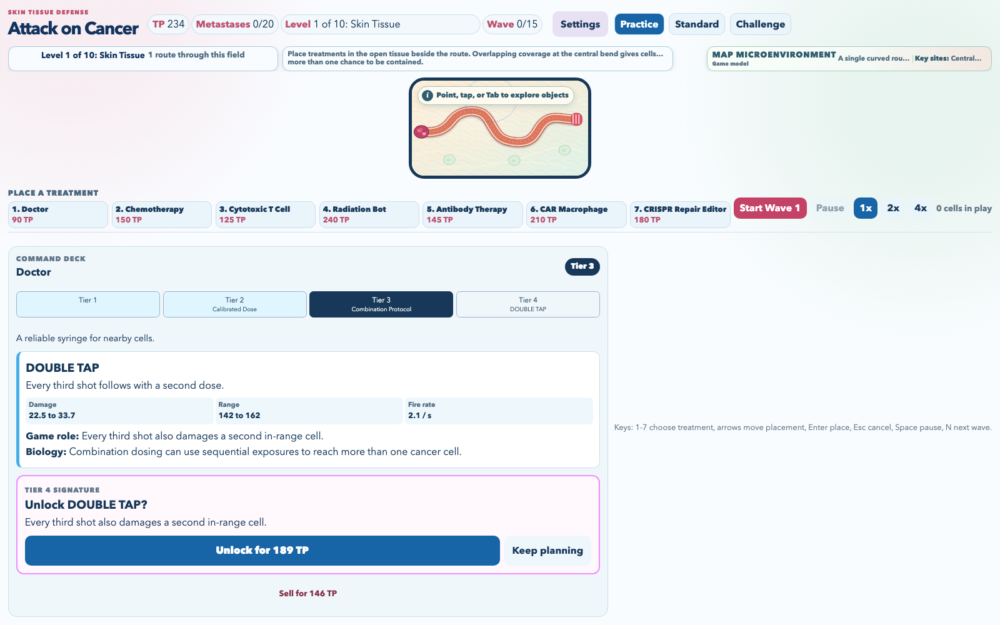
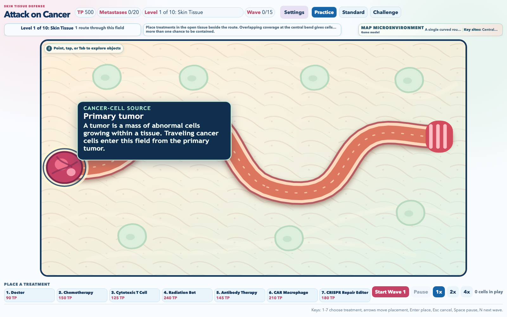
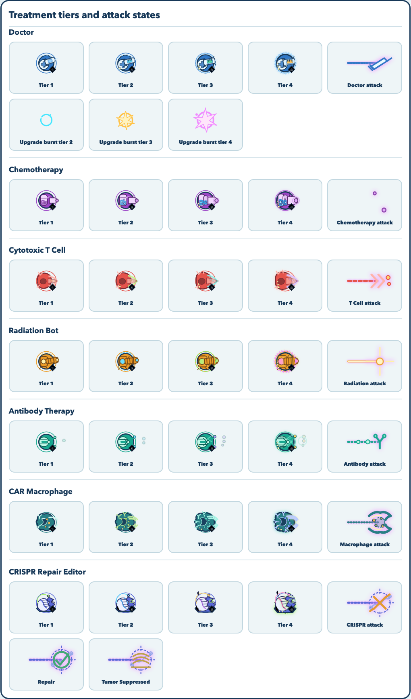
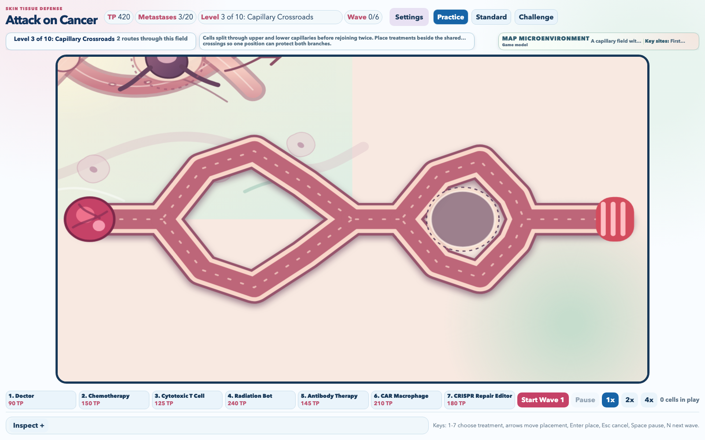

# Attack on Cancer

A bright browser tower-defense game for students and curious players who want to explore a
microscopic cancer-defense campaign through readable, strategic treatment placement.

**Status:** a playable, linear ten-level campaign that builds as a static site. It uses no
accounts, backend, analytics, or external art assets.

**Play online:** [vosslab.github.io/attack-on-cancer](https://vosslab.github.io/attack-on-cancer/)

## Defend the tissue world

The signature promise is a complete tower-defense journey with biology as readable game context.
Cancer cells leave a primary tumor, travel across a living microscopic landscape, and make each
targeting and placement decision visible.

- Progress through ten ordered maps, from Skin Tissue and Cluster Corridor to multi-route tissue
  worlds with visible splits, merges, crossings, and constrained biological spaces.
- Learn placement lessons from the map: protect a shared crossing, cover an early source, defend
  a fast bypass, or use a late convergence zone.
- Read seven treatments at a glance through distinct attack cues: syringe shot, area burst,
  immune strike, radiation beam, antibody chain, phagocytic cup, and guide-RNA editor.
- Use pointer, touch, or keyboard controls; pause or fast-forward at 1x, 2x, or 4x.
- Choose Practice, Standard, or the intentionally dense, resource-tight Challenge mode.

The campaign is a teaching game model, not clinical advice, a diagnostic tool, or a prediction of
patient outcomes. In particular, the CRISPR Repair Editor is a speculative game abstraction, not
an approved treatment.

## See progression in play

Skin Tissue introduces open-tissue placement. Cluster Corridor asks for a fresh build along a
longer, winding route. Levels 3-10 add route structure and original microscopic world sheets:
Capillary Crossroads, Lymph Node Loop, Alveolar Switchbacks, Ductal Delta, Vascular Bypass,
Fibrotic Sieve, Marrow Lattice, and Metastatic Confluence.

Each level opens only after the prior field is contained. The campaign deliberately has no level
select or mid-campaign replay screen: the next map is part of the strategic progression.

The treatment artwork evolves with its upgrades. The command deck explains the next biological
and gameplay change, while each tower's visible material palette makes a stronger treatment easy
to spot in the middle of a wave.

<!-- screenshots:begin (managed by screenshot-docs) -->








<!-- screenshots:end -->

## Quick start

Install Node.js dependencies once after cloning:

```bash
npm install
```

Build the production-shaped GitHub Pages artifact and open a local preview:

```bash
./run_web_server.sh
```

The preview serves `dist/`, not the source tree, on a random local port. For a first result,
choose a treatment, place it on open tissue, and select **Start Wave 1**.

To build the static artifact without starting a server:

```bash
./build_github_pages.sh
```

To regenerate the editable-world components and run the complete fast source gate:

```bash
./run_fast_checks.sh
```

The build writes the GitHub Pages-ready site to `dist/`.
`./capture_screenshots.sh` refreshes six current documentation views, including upgrade,
signature-review, and map-learning states, and
builds the separate all-world browser contact sheet under
`test-results/visual-assets/`. The Level 3 and Level 10 campaign screenshots
above come from the real-UI visual matrix.

## How to play

Choose a difficulty, place treatments on legal open tissue, and start each wave when ready.
Destroyed or repaired cells earn Treatment Points (TP); every cell reaching the exit adds one
metastasis point.

- Clear a field and its remaining cells to earn the next campaign map.
- Rebuild on each new field; towers clear while metastases persist across the campaign.
- Place towers beside routes, not on them or on blocked biological landmarks.
- Point to, tap, or Tab to a named route, landmark, or obstacle for an optional learning tooltip.
  Press Escape or select open tissue to return to treatment placement.
- Select a placed treatment to open its Command deck, upgrade its three linear tiers, or sell it.
  The lower-right crest and treatment-specific material colors make Tier 1-4 immediately readable.
- Select a cancer cell to see concise biology context without opening a separate generic panel.
- Reaching the selected metastasis capacity ends the run.

> Example: Antibody Therapy marks a blue Immune-Evasive cell. Its teal ring means the cell slows,
> takes more damage, and no longer resists a Cytotoxic T Cell attack.

## Controls

| Action                | Pointer or touch     | Keyboard                  |
| --------------------- | -------------------- | ------------------------- |
| Select treatment      | Select a tray button | `1` through `7`           |
| Move placement cursor | Move pointer         | Arrow keys                |
| Place treatment       | Tap or click tissue  | Enter                     |
| Cancel placement      | Select another tool  | Esc                       |
| Explore scene object  | Point, tap, or click | Tab to the object         |
| Close object tooltip  | Select open tissue   | Esc                       |
| Pause or resume       | Select Pause         | Space                     |
| Start the next wave   | Select Start Wave    | N                         |
| Change speed          | Select 1x, 2x, or 4x | Use the on-screen control |

## Treatment roster

| Treatment            | Strategic role                           | Attack cue                         |
| -------------------- | ---------------------------------------- | ---------------------------------- |
| Doctor               | Low-cost nearby single-target treatment. | Dashed syringe shot.               |
| Chemotherapy         | Tier-scaled splash treatment for tight groups. | Purple cloud, shock ring, and droplets. |
| Cytotoxic T Cell     | Fast single-target immune attacks.       | Red rapid immune strike.           |
| Radiation Bot        | Expensive, long-range, heavy strikes.    | Heavy gold beam and target lock.   |
| Antibody Therapy     | Marks, slows, and sensitizes cells.      | Teal antibody chain and mark ring. |
| CAR Macrophage       | Experimental close-range engulfing.      | Closing teal phagocytic cup.       |
| CRISPR Repair Editor | Speculative, low-chance repair effect.   | Indigo guide-RNA target.           |

## Difficulty

| Difficulty | Starting TP | Metastasis capacity |
| ---------- | ----------: | ------------------: |
| Practice   |         500 |                  20 |
| Standard   |         380 |                  15 |
| Challenge  |         200 |                   7 |

Each refresh starts a new campaign. Sound preference, preferred speed, and the best result per
difficulty are the only saved settings. Challenge sends 40% more cancer cells in every wave group;
Practice and Standard use the authored fixed wave counts.

## More information

- [docs/archive/aoc_ten_level_branching_campaign.md](docs/archive/aoc_ten_level_branching_campaign.md)
  records the completed campaign design, acceptance evidence, and close-out.
- [docs/SOLID_MODEL.md](docs/SOLID_MODEL.md) explains the client-side SolidJS model.
- [docs/PLAYWRIGHT_USAGE.md](docs/PLAYWRIGHT_USAGE.md) explains browser-test setup and execution.
- [docs/CHANGELOG.md](docs/CHANGELOG.md) records implementation history.

## Scope and license

Attack on Cancer intentionally excludes clinical decision-making, patient outcomes, accounts,
backend services, and in-progress campaign persistence. The project is available under the
[MIT License](LICENSE.MIT.md).
